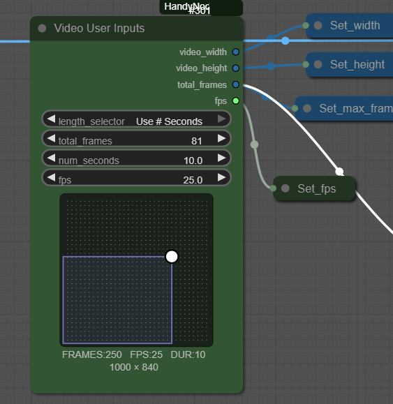
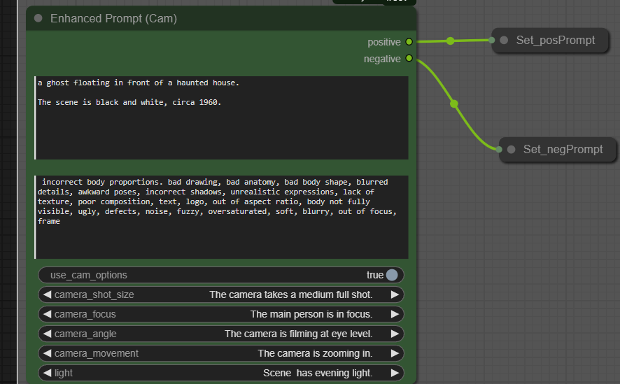

# TKNodes (Handy Nodes for ComfyUI)

# TKVideoUserInputs - general purpose node for collecting inputs for creating a video.

# TKEnhancedPrompt - node that contains positive/negative prompt +
#                    common camera descriptives (so it saves you from typing too much)

for manual install
---------------------
https://github.com/trashkollector/TKNodes

go to the custom_nodes folder in comfy

execute 
git clone https://github.com/trashkollector/TKNodes

