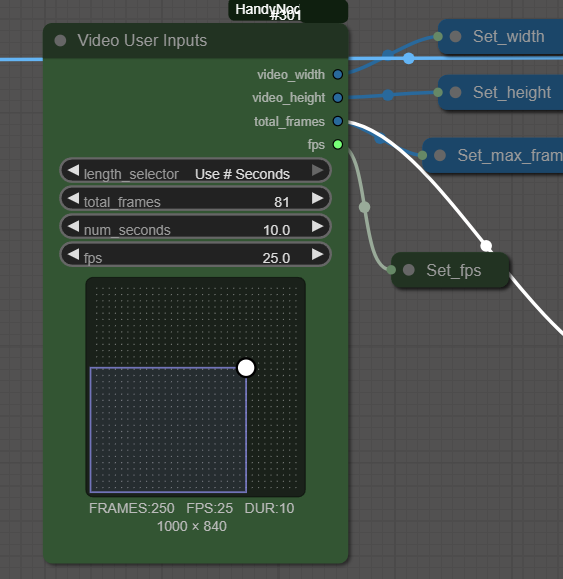

# TKSmartVideoChunker
Silence-based video/audio chunking for LTX 2.3 / Wan 2.2.   Looks for silence in audio to create chunk breaks.   
This is helpful when speakers take a breath and we don't cut off speaker while talking. 
Chunking is required to get around VRAM issues.  For Low VRAM set chunk size lower"

 Silence-based video/audio chunking for LTX 2.3 or Wan 2.2. Slices at native fps, resamples to target_fps, and snaps to a valid frame count

# TKSmartAudioChunker
Silence based audio chunker.. used in workflow for Singing or Talking, so it never breaks middle sentence.

# TKPromptLooper
A node for looping multiple prompts and avoid messy code.

# TKAudioToFPSMatcher
Mismatches between FPS can throw sync off in videos with audio.
This node fixes the FPS mismatch problem

# TKAudioUnwrap
when working with audio segments, this is needed to consolidate back to 1 waveform.

# TKVideoUserInputs - 
GUI for collecting inputs for Video related workflow.
Easily select size with visual feedback.

# TKPrintValueToLog
Print value to log, helpful for debug or status of workflow

# TKTransitionDetector  
Detects scene changes in video, similar to how Davinci works.

# TKSnapFrames  
Snap frames for LTX or Wan boundry rules
If you don't snap frames , you might get errors or bad renders.
This avoid the clumsy math expressions that are normally required in the workflow

# TKNodes (Handy Nodes for ComfyUI)
     "TKPromptEnhanced": "Enhanced Prompt with camera descriptives",
     "TKTrimAudioWithBooleans": "Trim Audio (Booleans)",
     "TKCalcLTXFrames":    "Calculate LTX Frames ",
     "TKVideoUserInputs": "Video User Inputs",
     "TKPhotoUserInputs": "GUI - Photo User Inputs",
     "TKVideoUserInputsBasic": "Video User Inputs Basic",
     "TKVideoAudioFuse": "Video Audio Fuse",
     "TKAudioFuse": "Audio Merge/Fuse",
     "TKSmartAudioChunker": "Smart Audio Chunker",
     "TKSmartVideoChunker": "Smart Video Chunker",
     "TKAudioUnwrap": "Audio → Waveform Tensor",
     "TKPrintValueToLog": "Print Value to log",
     "TKSpeakerAudioTrackExtractor": "Extract nTh Audio track",
     "TKMergeAudioList": "Merge audio list to master audio",
     "TKTotalTracksInAudio": "User supplied tracks",
     "TKLocateSpeakersUsingSilenceBreaks": "Identify Speakers using Silence Breaks",
     "TKTrimImageOverlap": "Trim Padding used for Smooth Transition",
     "TKSpeakerDataFromTrack" : "Get a Track details from Track",
     "TKAudioSpeakerTalkTime": "Speaker Talk Times",
     "TKFadeInVideo": "Fade in Video",
     "TKPromptLooper": "Prompt Looper",
     "TKCrossDissolve":"Cross Dissolve Effect",
     "TKTrimFrames": "Trim Frames and Audio",
     "TKTransitionDetector": "Video Transition Detector",
     "TKSnapFrames" : "Snap Frames to boundry rules",
     "TKAudioToFPSMatcher" :"Resample Audio for new FPS",

for manual install
---------------------
https://github.com/trashkollector/TKNodes

go to the custom_nodes folder in comfy

git clone https://github.com/trashkollector/TKNodes

