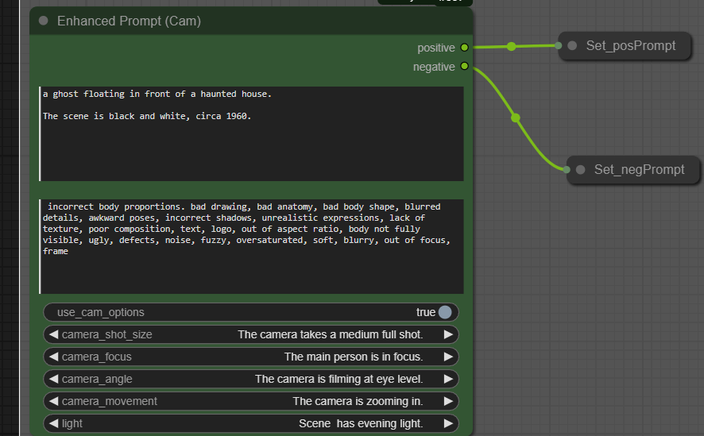

# TKNodes (Handy Nodes for ComfyUI)
     "TKPromptEnhanced": "Enhanced Prompt with camera descriptives",
     "TKTrimAudioWithBooleans": "Trim Audio (Booleans)",
     "TKCalcLTXFrames":    "Calculate LTX Frames ",
     "TKVideoUserInputs": "Video User Inputs",
     "TKPhotoUserInputs": "GUI - Photo User Inputs",
     "TKVideoUserInputsBasic": "Video User Inputs Basic",
     "TKVideoAudioFuse": "Video Audio Fuse",
     "TKAudioFuse": "Audio Merge/Fuse",
     "TKSmartAudioChunker": "Smart Audio Chunker",
     "TKSmartVideoChunker": "Smart Video Chunker",
     "TKAudioUnwrap": "Audio → Waveform Tensor",
     "TKPrintValueToLog": "Print Value to log",
     "TKSpeakerAudioTrackExtractor": "Extract nTh Audio track",
     "TKMergeAudioList": "Merge audio list to master audio",
     "TKTotalTracksInAudio": "User supplied tracks",
     "TKLocateSpeakersUsingSilenceBreaks": "Identify Speakers using Silence Breaks",
     "TKTrimImageOverlap": "Trim Padding used for Smooth Transition",
     "TKSpeakerDataFromTrack" : "Get a Track details from Track",
     "TKAudioSpeakerTalkTime": "Speaker Talk Times",
     "TKFadeInVideo": "Fade in Video",
     "TKPromptLooper": "Prompt Looper",
     "TKCrossDissolve":"Cross Dissolve Effect",
     "TKTrimFrames": "Trim Frames and Audio",

# TKVideoUserInputs - 
General purpose node for collecting inputs for creating a video.
Specify video length by # Frames or by # Seconds
Everything is grouped together for tidy workflow.

# TKPhotoUserInputs
Larger grid 3000 x 3000 , useful for selecting image size

# TKEnhancedPrompt - 
Node that contains positive/negative prompt +                   
common camera descriptives (so it saves you from typing too much)

# TKVideoAudioFuse
Fuse up to 3 audio streams and video together

# TKAUdioFuse
Fuse up to 3 audio streams together

for manual install
---------------------
https://github.com/trashkollector/TKNodes

go to the custom_nodes folder in comfy

git clone https://github.com/trashkollector/TKNodes

